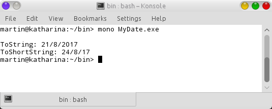

# The this Reference
     
 

Every object can access a reference to itself, called the this reference. The this reference can refer implicitly to the instance variable, properties and methods of an object.

Two uses of the this keyword are:
<ol>
<li>To resolve ambiguity between instance variables and parameters</li>
<li>To pass the current object as a parameter to another method</li>
</ol>

The first constructor receives three uint parameters which names are identical to the instance variables of the class. I did this to illustrate explicit use of the <b>this</b> reference.

<b>Fig 1 This reference output</b>
 

  

The explicit use of the <b>this</b> reference can increase program clarity in some contexts where <b>this</b> is optional.

